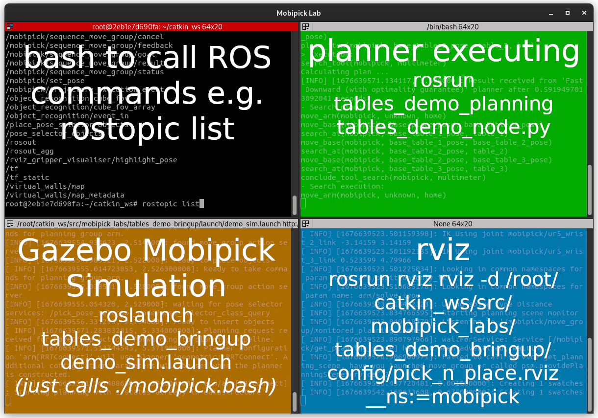

# Mobipick Lab docker
Docker (compose) environment for the DFKI MobiPick lab (https://github.com/DFKI-NI/mobipick_labs)

# Dependencies
Install docker (or mobi) and docker-compose, install [nvidia-docker2](https://docs.nvidia.com/datacenter/cloud-native/container-toolkit/nvidia-docker.html) if you have an nvidia graphics card.

# Usage
If you just want to run the simulation withou planning and without rviz `mobipick.bash`. It will download all required container and start the mobipick-gazebo environment for the tables demo (see `command:` in `docker-compose.yml`).

To run custom ROS commands just prefix them with `./cmd.bash`. This starts a new docker container with your command connected to the ROScore of the mobipick-container instance.

Take a look at the `terminator.conf` file if you are interested how it all works together. If you have a slow PC you might also want to increase the values of `sleep` times to give Gazebo some more time to startup the simulation before planning.

## Example Run
### Option 1: run everything at once in terminator
Call the `./run.bash` script that starts up 4 docker container in separated terminator shells.
One of them is a terminal window with a bash inside a connected docker container in the top-left where you can call ROS-commands, the others are for rviz, mobipick simulation and the tables_demo_node, details are described in Option2.

When you close the terminator-window `docker-compose down` will be called to stop all container again.

### Option 2: run each command separately
Instead of starting all docker container and run one terminator for logging you can also start everything in single commands:

1. open a first terminal and run `./mobipick.bash` to start the Gazebo robot simulation with the mobipick robot inside.
1. (optional) in a second terminal run rviz to visualize the robot `./cmd.bash rosrun rviz rviz -d /root/catkin_ws/src/mobipick_labs/tables_demo_bringup/config/pick_n_place.rviz __ns:=mobipick`.
1. in a second window (or third window if you run rviz as well) start the autonomous planning `./cmd.bash rosrun tables_demo_planning tables_demo_node.py`.
1. (optional) it could also be helpful to run another terminal inside a docker container to call ROS commands and test stuff, just run `./cmd.bash bash` to start one.

## Shutdown
To stop everything call `docker-compose down`.
